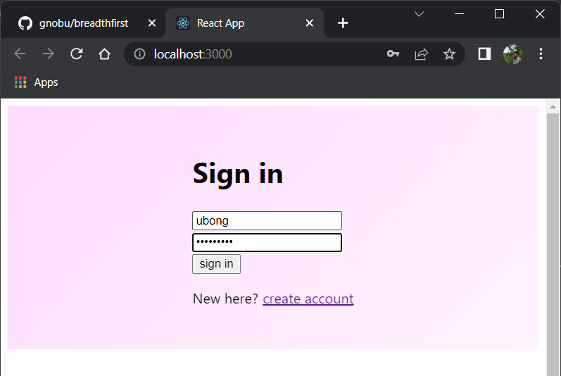
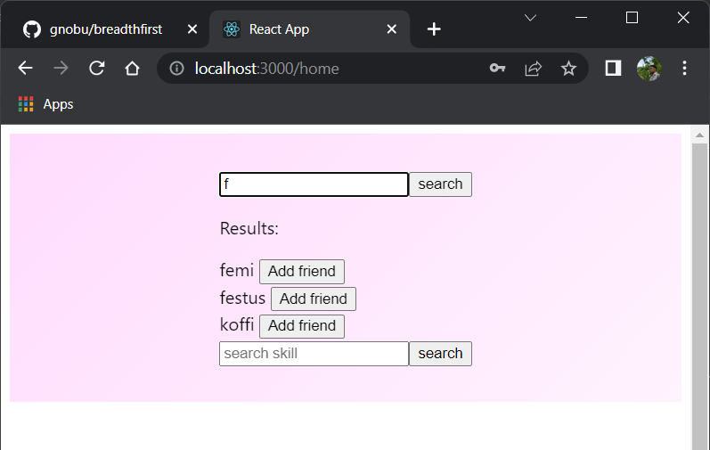
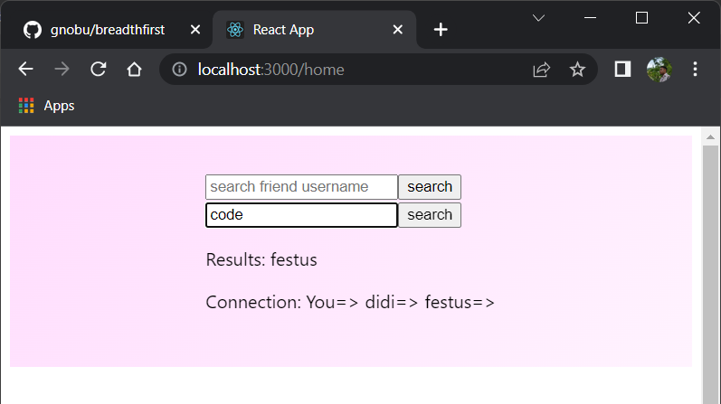

## About the Project
In this project, I implemented the concept of breadth-first search algorithm to build a schematic of a social media search engine.
This concept basically implies that a scan is done on the searcher's closest connections first, then if no result is found it proceeds 
to the next level of connections (the connections of the searcher's connections) and so on, till the connection tree is exhausted.
Eventually, an output (if found) is given, with the extent or depth of the connection.

## What was Used?
The project was built with the following:
- JavaScript (handling the logic)
- JavaScript library - React.js (handling the view)
- Also, some HTML and CSS was used (out of necesity and because why not?).
- Local storage and session storage were used to simulate back end calls.

## Try it out.
To test it out, follow these steps:
- Clone the repo and run "npm intall" to get necessary dependencies.
- Run "npm start" to start up the app in your browser.
- Sign up as many users as possible, as you need some users to search through.
- Add up some "friends" (these are the connections).
- Then search and see the output.

## Screenshots.
Just want to see the results? Here are some screenshots.

### Signing into the App

### Adding a Friend (Connection)

### Searching for a Skill

